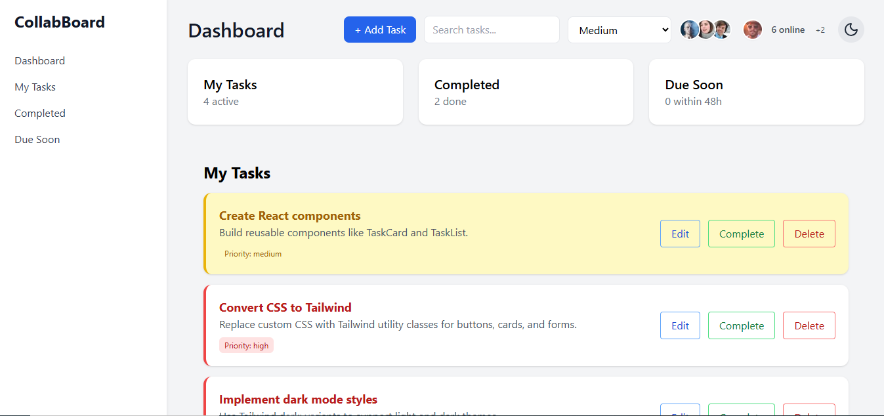
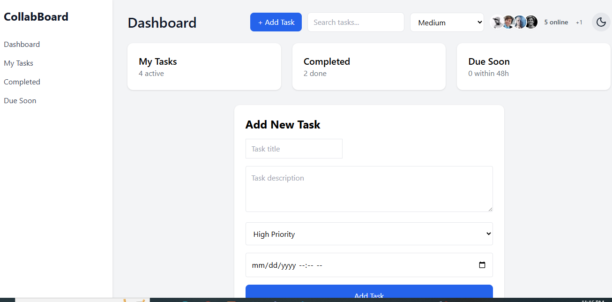
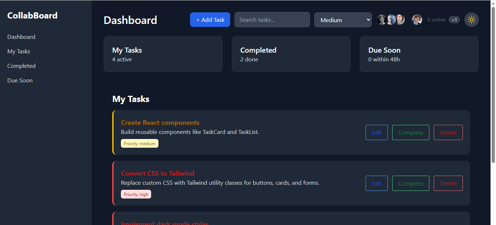
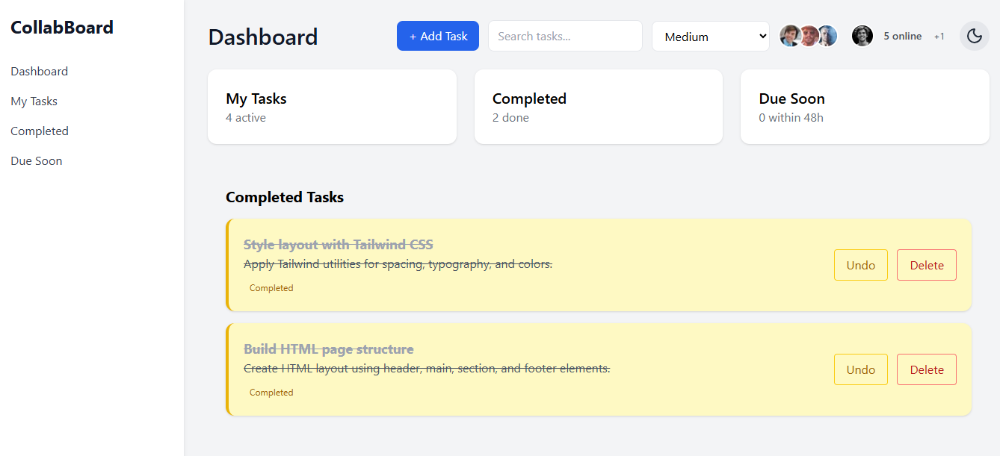

DOCUMENTATION

1. App purpose
CollabBoard is designed to provide:
 A clean and intuitive interface for managing daily tasks
 Priority-based task organization
 A smart dashboard showing summaries (My Tasks, Completed, Due Soon)
 Real-time–style team activity preview (“Who’s online”)
 Smooth UI animations using Framer Motion
 Dark/Light mode toggle
 Drag and Drop task reordering
 Local storage persistence

 2. Tech Stack Decisions

 Frontend
    Technology                      Why to choose Technolo
    React 19	                    Fast, component-based, reliable for scalable UI
    Vite	                        Extremely fast dev server + instant HMR
    Tailwind CSS	                Utility-first, responsive, fast styling
    Framer Motion	                Smooth animations & micro-interactions
    Context API	                    Simple and clean global state management
    React Router	                Smooth page navigation without refresh
    @hello-pangea/dnd	            Drag-and-drop compatible with React 19

Other Tools
LocalStorage for persistence
ES6 modules
Custom hooks for clean logic separation

3. Folder Structure

collabboard/
│
├── public/
│
├── src/
│   ├── components/
│   │   ├── TaskCard.jsx
│   │   ├── TaskList.jsx
│   │   ├── ThemeToggle.jsx
│   │   ├── CollabPreview.jsx
│   │   └── ...
│   │
│   ├── context/
│   │   ├── TaskContext.jsx
│   │   └── ThemeContext.jsx
│   │
│   ├── pages/
│   │   ├── Dashboard.jsx
│   │   ├── MyTasks.jsx
│   │   ├── Completed.jsx
│   │   ├── DueSoon.jsx
│   │   ├── AddTask.jsx
│   │   └── EditTask.jsx
│   │
│   ├── hooks/
│   │   └── useLocalStorage.js
│   │
│   ├── App.jsx
│   ├── main.jsx
│   ├── index.css
│   └── ...
│
├── package.json
└── README.md

✔ Clean separation of components
✔ Context stored in dedicated folder
✔ Pages for routes
✔ Hooks for reusable logic

4. How To Run the App
    1. Install Dependencies - npm install
    2. Start Development Server - npm run dev
    3. Build for Production - npm run build
    4. Preview Production Build - npm run preview

5. Future Improvements 
   a) User Accounts - Authentication (Google, Email/Password)
   b) assigning of tasks to other team 
   c) Advanced Task Tools - calender view, substasks, reminder and notification
   d) UI Enhancements - addition of more themes, Custom color accents, too i

SCREENSHOTS

Dashboard

 Add Task 
 

 Dark Mode

Completed Tasks

